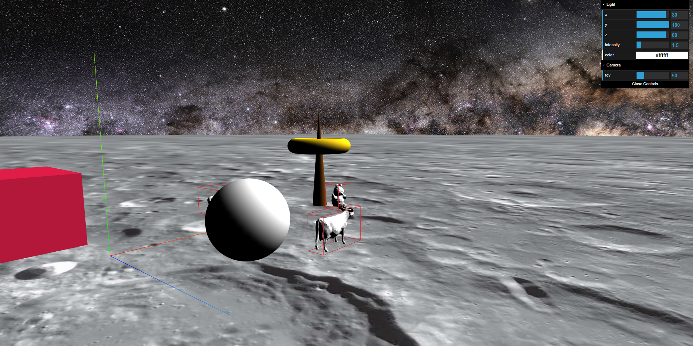

_Franck GUTMANN OS1_

# Rapport de P4x n°1


## TP1 

J'ai rapidement commencé à prendre en main Three.js, en ajoutant quelques `Mesh` de base dans la scène fournie.

Après avoir utilisé le matériel `MeshLambertMaterial` qui peut être utilisé pour des surfaces non brillantes, les `Mesh` n'étaient plus visibles dans la scène. Le materiel `MeshBasicMaterial` utilisé au départ n'était pas sensible à la lumière, ce qui n'est pas le cas du `MeshLambertMaterial`. Néanmoins, j'ai pu m'assurer que les formes étaient toujours bien présentes en changeant la couleur de fond en rouge.


Au départ j'ai voulu utiliser une `AmbientLight`, qui fourni en fait un éclairage global, et ne permet donc pas de profiter des effets de lumières sur les matériaux 


En ajoutant une lumière `PointLight` dans la scène, les formes sont désormais visibles avec le nouveau matériel


J'ai rapidement chercher à améliorer la qualité de la scène, tout d'abord en activant l'anti-aliasing, puis en modifiant la taille de la scène afin qu'elle soit en plein écran. Cela m'a permis de mieux comprendre la manière dont fonctionne Three.js, et d'aller me documenter sur les objets `PerspectiveCamera` et `WebGLRenderer`.

```js
renderer = new THREE.WebGLRenderer({antialias: true});
```

| Sans anti-aliasing | Avec anti-aliasing |
| --- | ----------- |
|  |  |

J'ai implémenté une interface avec `dat-gui` afin de pouvoir ajuster la lumière, et j'ai ajouté une sphère transparente afin de pouvoir visualiser l'emplacement de la lumière. J'en ai profiter pour ajouter des réglages supplémentaires comme la modification de la couleur de la lumière, et même le FOV de la caméra :


J'ai ajouté un sol en utilisant un `PlaneGeometry`, qui par defaut crée un plan vertical. Cela m'a permis de découvrir les rotations. Ces dernieres utilisant des angles trigonométriques, j'ai créer une fonction afin de pouvoir faire des rotations en indiquant des angles en degré, ce qui est plus naturel pour moi :

```js
const makeAngle = function(angle) {
        return angle * (Math.PI/180);
}
```

Pour terminer avec le 1er TP, j'ai ajouté quelques formes pour me familiariser avec des géométries de bases, mais je n'ai pas passé beaucoup plus de temps à essayer de modéliser des objets de cette manière car j'ai pensé que ça serait bien plus intéressant de remplir ma scène avec des modèles.


-------------
## TP2

Afin de pouvoir créer des objets `.OBJ` facilement dans ma scène, j'ai voulu créer une fonction qui fait tout ce travail automatiquement.


J'ai pu intégrer à cette fonction la mise à l'échelle ainsi que la placement en hauteur par rapport au sol.
En effet, par defaut, chaque objet se charge à la taille à laquelle il a été conçu. 

Pour arriver à ça, il m'a fallu trouver comment obtenir la taille et les coordonnées de l'objets. J'ai créé deux fonctions utilitaires qui font cela pour moi

```js
const getObjectBox = function(object) {
        let box3 = new THREE.Box3().setFromObject(object);
        return box3;
}

const getObjectSize = function(object) {
        let vector3 = new THREE.Vector3();
        getObjectBox(object).getSize(vector3);
        
        return vector3;
}
```

Il a fallu ensuite trouver comment faire en sorte de les mettre à l'échelle pour qu'ils aient une taille par défaut de 1m. J'ai pu faire celà grâce a un simple produit en croix, car la documentation indique que l'echelle par defaut de chaque objet est de 1.


```js
let resultScale = (1/ size.y) * deriredScale
```

Puis, pour le placement par rapport au sol, on n'a plus qu'a partir de la position y minimale de l'objet ainsi mis à l'échelle.

J'avais fait tout cela avant même de lire la suite de l'enoncée qui demande de créer une fonction pour cela. Il ne me restait plus qu'à ajouter la possibiliter d'appliquer une rotation, et voilà ce que ça donne :

```js
const createOBJModel = function(model,x, y, z, rX, rY, rZ, scale) {
    loader.load(
        model, 
        function(object) {

            // Mise à l'echelle
            let size = getObjectSize(object)
            let s = (1/ size.y) * scale
            object.scale.set(s, s, s)

            // Positionnement
            let adjustedBox = getObjectBox(object);
            object.position.set(x, Math.abs(adjustedBox.min.y)+y, z)
            scene.add(object)

            // Rotation
            object.rotateX(makeAngle(rX));
            object.rotateY(makeAngle(rY));
            object.rotateZ(makeAngle(rZ));
            
            // BoxHelper
            let box = new THREE.BoxHelper(object, boxColor);
            scene.add(box)

        },
        function(xhr) {},
        function (error) {
            console.error(error);
        }
    );
}
```

Grâce à ça, le chargement d'un model `.OBJ` devient aussi simple que ça :

```js
createOBJModel('bear.obj', 8, 0, 1, 0, 0, 0, 1)
```

J'ai longtemps cherché à ajouté un ciel en essayant plusieurs méthodes, avant de finalement partir sur une solution très simple.
J'ai créé une énorme sphère, avec une image de ciel déssinée uniquement vers l'intérieur. 

J'ai appris à utilisé le `TextureLoader` de Three.JS pour charger la texture du ciel. Son fonctionnement est très similaire à celui du `OBJLoader`.

```js
const skyLoader = new THREE.TextureLoader();
    skyLoader.load(
        // resource URL
        'sky.jpg',

        // onLoad callback
        function ( texture ) {

            var geometry = new THREE.SphereGeometry(500, 60, 40);
            var material = new THREE.MeshBasicMaterial();
            material.map = texture;
            material.side = THREE.BackSide;
            var skydome = new THREE.Mesh(geometry, material);

            scene.add(skydome);
            
        },

        // onProgress callback currently not supported
        undefined,

        // onError callback
        function ( err ) {
            console.error( 'An error happened.' );
        }
    );
```

J'en ai alors profité pour ajouter aussi une texture au sol :



