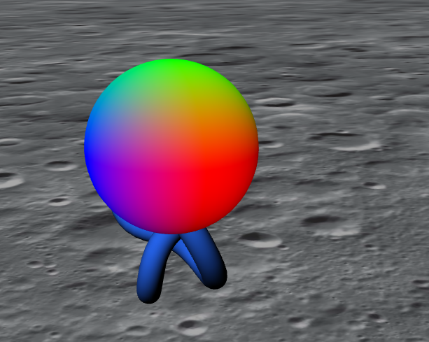
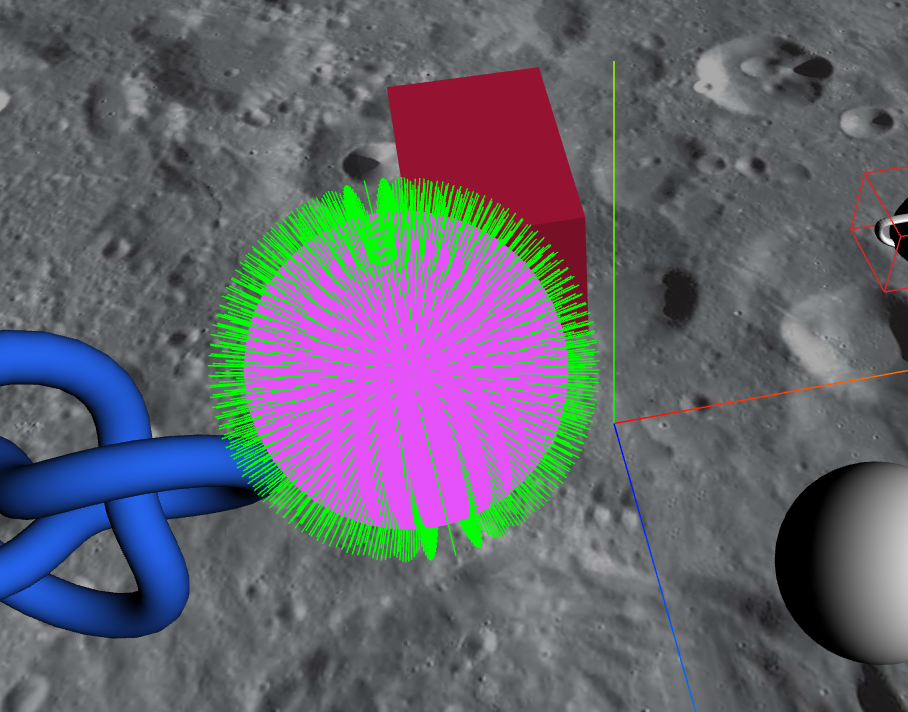
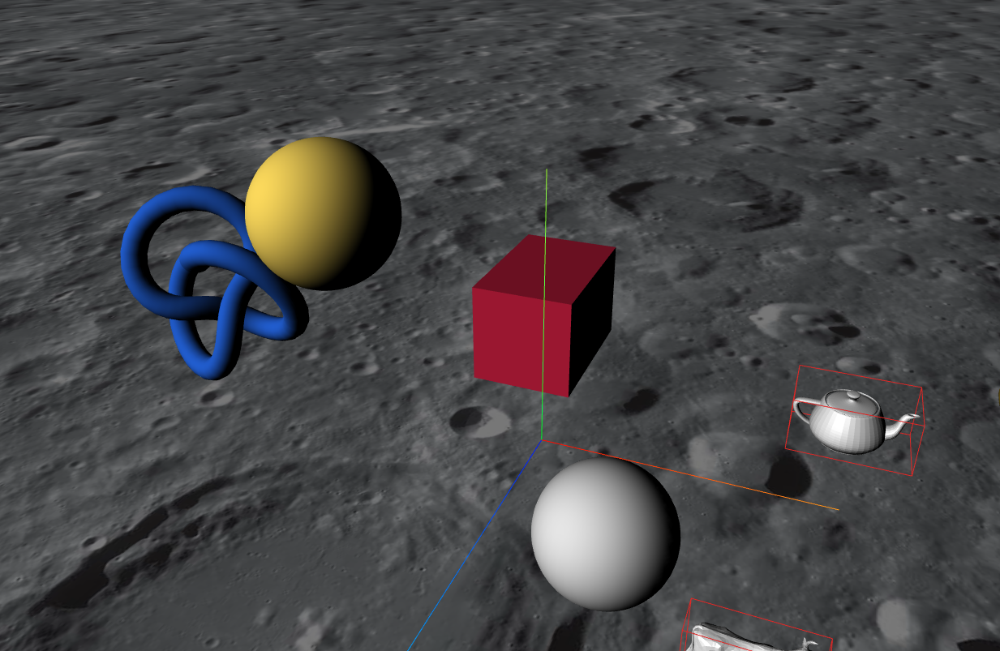
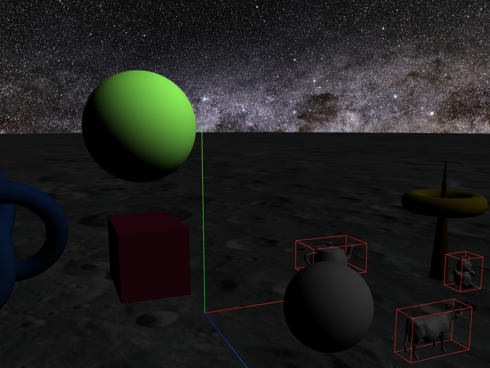
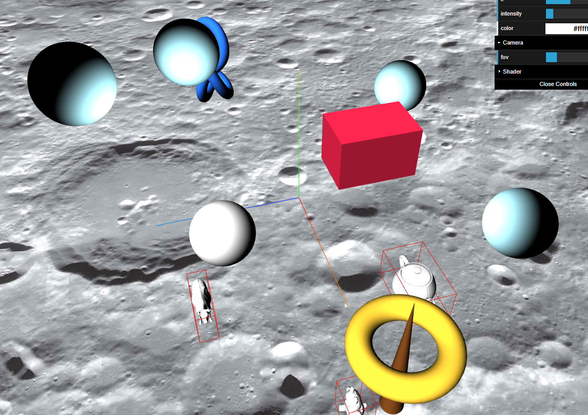

_Franck GUTMANN OS1_

# Rapport de P4x n°2

Après avoir ajouté une sphère et intégré un shader sur le modèle de l'exemple `basicshader` fourni, j'ai passé un petit moment à expérimenter les possibilités des shaders.  

Le premier shader que j'ai implémenté est une variante de celui présenté dans l'exemple `uniforms.html`. Comme ce dernier, celui ci fait aussi varier la couleur de l'objet, mais cette fois ci de manière fluide, sans qu'il n'y ai jamais de "saut" soudain de couleur. 

Dans l'exemple le saut de couleur qui survient est lié à l'utilisation de la fonction `fract`. Cette dernière retourne la partie décimale d'un nombre. Ainsi, dès que les valeurs incrémentés franchissait un nouvel entier, la composante de couleur en question passait soudainement de 0.99 à 0.00.

Pour remédier à cela, je me suis inspiré de ce que nous avions déjà vu sur les shaders en `S4x`. En utilisant des fonctions trigonométriques `sinus` et `cosinus`, les valeurs sont interpolées entre 0 et 1, et ce sans jamais de saut brutal. Ainsi, les couleurs varient en permanance sans "saut" :


C'est une variable appelée `time` qui est incrémenté à chaque image qui est responsable de cette variation. Ainsi, modifier la valeur de son incrément modifie la vitesse de variation des couleurs. J'ai donc ajouté ce paramètre à l'interface `dat-gui` afin de pouvoir la faire varier librement
J'ai egalement défini des coefficients différents pour chaque composantes `rgb`, afin que ces dernieres ne soit pas égales et ainsi obtenir des couleurs au lieu de niveaux de gris.

```js
/* Variation de couleur de myPixelShader */
let time = 0;
let timeIncrement = 0.01;
let rCoef = 7;
let gCoef = 5;
let bCoef = 3;

function animate() { 

        time+= timeIncrement;

        //on l'assigne au registre uniform déclaré dans le pixel shader
        shaderSphere.material.uniforms.rgb.value.set(
                Math.cos(time*rCoef/100),
                Math.sin(time*gCoef/100),
                Math.cos(time*bCoef/100)
        );

        requestAnimationFrame(animate);
        renderer.render(scene, camera);       
}
```

Par la suite, afin de préparer l'implémentation d'un shader plus avancé, j'ai importé la classe `VertexNormalsHelper` afin de visualiser les normales à ma forme. On remarque au premier coup d'oeuil que ces dernières sont correctement orientées. En effet, cela se vérifie en affichant les valeurs du vecteur normal de chaque point sous forme des composantes RGB de la boule :



J'ai continué la découverte des shaders en étudiant l'exemple `varying.html`.
En ajoutant un paramètre `varying` interpolé par le VertexShader puis passé au FragmentShader, j'ai pu implémenté une variation de couleur selon la position x, y, et z du pixel. Combiné à la valeur des composants `rgb` qui varient avec le temps selon des fonctions trigonométriques, cela donne des "lignes" dont l'épaisseur et l'espacement varie.



Après ces petites "expérimentations", j'ai commencé à implémenter un éclairage de lambert. J'ai tout d'abord rencontré quelques difficultés notamment pour trouver les bonnes données à utiliser, ainsi que les fonctions de normalisation et de produit scalaire. 
De plus, j'ai utilisé pendant un moment la `normalMatrix`, qui est elle même la transposée inverse de la `modelViewMatrix`, qui dépend de la position de la caméra. Ainsi, la lumière était relative à la rotation de la caméra, ce qui n'est pas le résultat correct attendu. Après quelques recherche supplémentaire, j'ai finalement trouver la bonne manière de faire.




Néanmoins, comme on peut le voir, ce shader n'est pas sensible à l'intensité de la lumière. J'ai donc cherché à ajouter l'intensité de la lumière dans le calcul. 

Je n'ai d'abord pas réussi à transmettre correctement l'intensité de la lumièr au shader, car j'oubliais de mettre à jour la valeur qu'elle était changée via l'interface. Au final, j'ai crée une nouvel uniforms de type `float`,contenant la valeur de l'intensité de la lumière. En multipliant cette derniere à au vecteur rgb souhaité, j'obtient bien le résultat escompté.



Dernière chose à faire : rendre le shader sensible à la couleur de la lumière. C'est chose faite en moins d'une minute en ajoutant une nouvelle `uniform` de la couleur de la lumière que je multiplie au résultat. Voici le code final du pixel shader de mon éclairage Lambert  :

```c
        varying vec3 vNormal;
        varying vec3 vPosition;
        uniform vec3 rgb;
        uniform vec3 lightPos;
        uniform vec3 lightColor;
        uniform float lightIntensity;

        void main()
        {
                vec3 color = (rgb*lightIntensity*lightColor) * dot(normalize(vNormal), normalize(lightPos - vPosition));
                gl_FragColor = vec4(color, 1.0);
        }
```