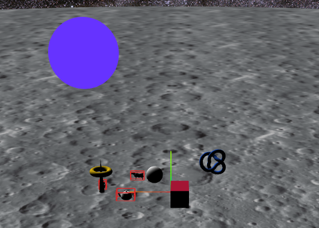

_Franck GUTMANN OS1_

# Rapport de P4x n°2

Après avoir ajouté une sphère et intégré un shader sur le modèle de l'exemple `basicshader` fourni, j'ai passé un petit moment à expérimenter les possibilités des shaders.  



Le premier shader que j'ai implémenté est une variante de celui présenté dans `uniforms`. Il fait aussi varier la couleur, mais de manière fluide en permanance, sans qu'il n'y ai jamais de "saut" soudain de couleur. 

Pour cela, je me suis inspiré de ce que nous avions déjà fait sur les shaders en S4x. En utilisant les fonctions `sinus` et `cosinus`, les couleurs varient sans jamais passer de 255 à 0 brutalement. 


C'est une variable appelée `time` qui est incrémenté à chaque image qui est responsable de cette variation. Ainsi, modifier la valeur de son incrément modifie la vitesse de variation des couleurs. J'ai donc ajouté ce paramètre à l'interface `dat-gui` afin de pouvoir la faire varier librement
J'ai egalement défini des coefficients différents pour chaque composantes `rgb`, afin que ces dernieres ne soit pas égales et ainsi obtenir des couleurs au lieu de niveaux de gris.

```js
/* Variation de couleur de myPixelShader */
let time = 0;
let timeIncrement = 0.01;
let rCoef = 7;
let gCoef = 5;
let bCoef = 3;

function animate() { 

        time+= timeIncrement;

        //on l'assigne au registre uniform déclaré dans le pixel shader
        shaderSphere.material.uniforms.rgb.value.set(
                Math.cos(time*rCoef/100),
                Math.sin(time*gCoef/100),
                Math.cos(time*bCoef/100)
        );

        requestAnimationFrame(animate);
        renderer.render(scene, camera);       
}
```

J'ai ensuite importé la classe `VertexNormalsHelper` afin de visualiser les normales à ma forme. Ces dernières sont correctement orientées, on peut donc passer à la suite.
En ajoutant un paramètre `varying` interpolé par le VertexShader et passé au FragmentShader, j'ai pu implémenté une variation de couleur selon la position x, y, et z du pixel. Combiné à la valeur des composants `rgb` qui varient avec le temps selon des fonctions trigonométriques, cela donne des "lignes" dont l'épaisseur et l'espacement varie.


