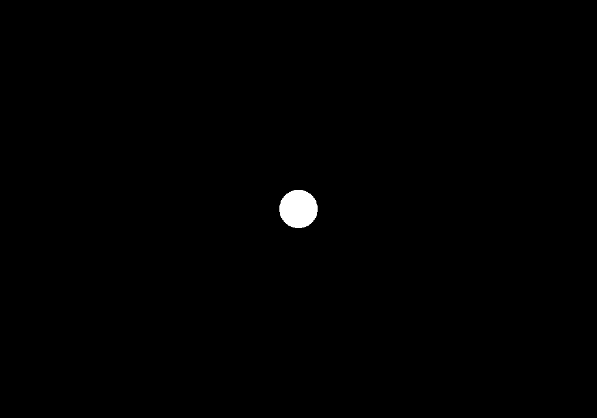
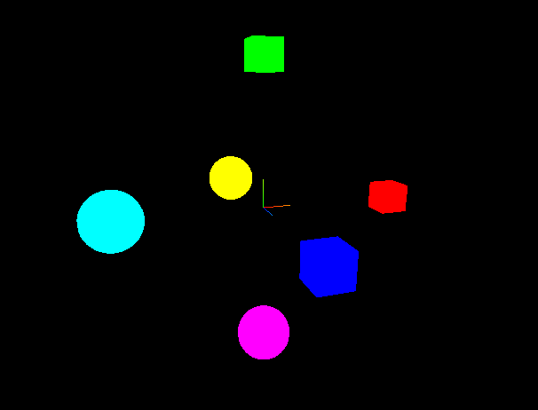
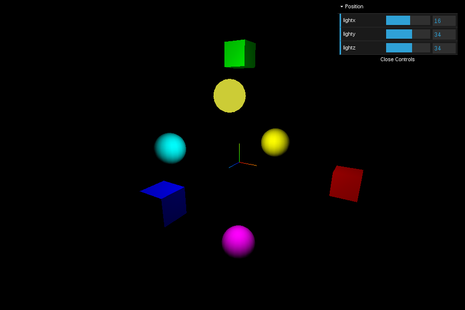
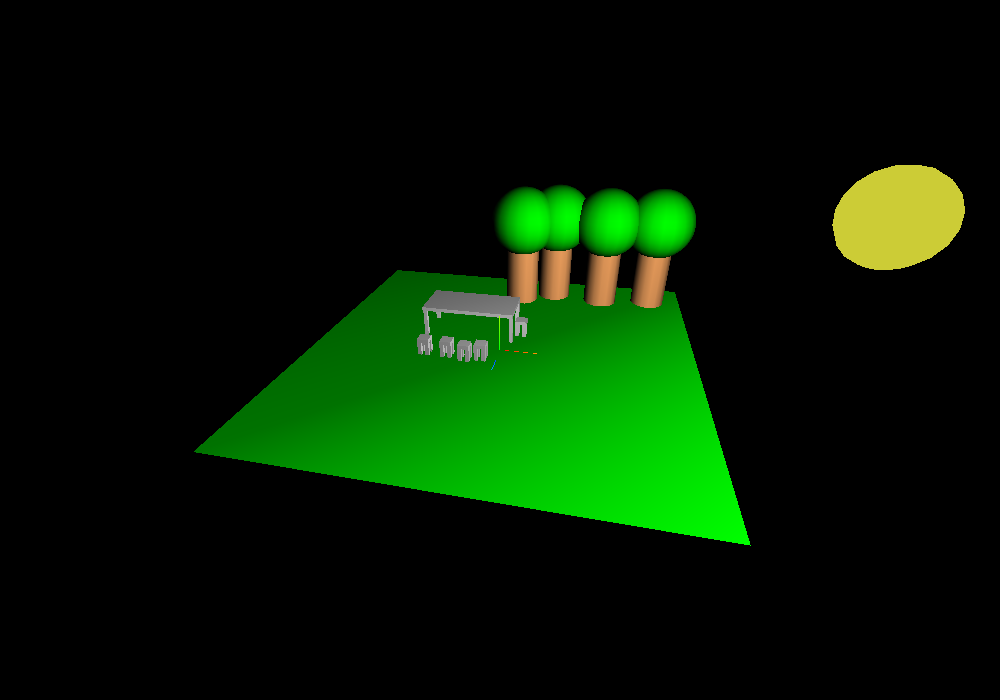

# Prise en main Three.js

Ce TP fait appel à plusieurs middlewares (intergiciel en français mais personne ne dit cela) :
 - Three.js pour la 3D
 - dat-gui pour la GUI
 - OrbitControls pour la manipulation de la caméra

L'objectif de ce premier TP est de prendre en main la bibliothèque Three.js.

### Rappel
Three.js est un middleware, permettant de faciliter la mise en oeuvre WebGL.
Il s'assimile plus couramment au concept de moteur 3D.

Les fichiers scene.js et index.html sont fournis avec une implémentation basique d'une scène Three.js avec une sphère et une caméra. Le TP va se dérouler à partir de ce squelette de code.
Pensez à faire des captures d'écran, des commits sous git, ou des copies de vos fichiers sources pour pouvoir montrer votre progression dans votre rapport.

Travail demandé :

- Prendre connaissance du contenu du répertoire TP1.

- Lancer un serveur HTTP local (voir TP0) dans le répertoire TP1. Connecter votre navigateur sur le serveur local, consulter le fichier index.html, vérifier que tout fonctionne, vous devriez voir l'écran suivant :



- Ajouter plusieurs Mesh simples comme des cubes ([BoxGeometry](https://threejs.org/docs/index.html#api/en/geometries/BoxGeometry)) ou des sphères ([SphereGeometry](https://threejs.org/docs/index.html#api/en/geometries/SphereGeometry)) avec un matériau coloré basique ([MeshBasicMaterial](https://threejs.org/docs/index.html#api/en/materials/MeshBasicMaterial)). On pourra alors obtenir quelque chose de similaire à cela :



- Changer le matériau utilisé pour les objets pour un [MeshLambertMaterial](https://threejs.org/docs/index.html#api/en/materials/MeshLambertMaterial). 

- Que constate-t-on  ? (pensez à lire la documentation !).

- Si vous n'avez pas compris ce qu'il s'est passé, essayez de changer la couleur de fond avec l'instruction :
```js
scene.background = new THREE.Color( 0xff0000 );
```
Que peut-on en déduire ?

- Ajouter une lumière ponctuelle à la scène ainsi qu'une sphère transparente qui matérialise cette source de lumière. Que constate-t-on maintenant ?

- Ajouter une interface réalisée avec la bibliothèque [dat-gui](https://github.com/dataarts/dat.gui) (voir annexe 1 ci-dessous) permettant de contrôler la position de la lumière dans la scène. Vous devriez obtenir un résultat similaire au suivant :



- Ajouter la navigation à la souris en utilisant la classe OrbitControls. Le fichier contenant cette bibliothèque est fournie dans le répertoire TP1. Exemple : [OrbitControls](https://threejs.org/docs/#examples/controls/OrbitControls)

- Créer une petite scène montrant votre compréhension des différents objets géométriques fournis dans Three.js. Modéliser des objets simples de votre quotidien avec pour échelle une unité = 1 mètre. Cette scène servira comme décor pour les prochains TPs. Laissez parler votre créativité !
 


- Remplacer OrbitControls par [FlyControls](https://threejs.org/docs/index.html#examples/en/controls/FlyControls). Chercher le fichier source sur le site, et ajouter le fichier au bon endroit dans l'arborescence de fichiers. Comprendre comment ajouter des modules sera très utile pour la suite.

## Annexe 1

Exemple de code pour utiliser la bibliothèque dat-gui :
```js
var gui = new dat.GUI();
var parameters = {
   val : 12,
   color : '#ff233b',
   f : function () { ... }
};
var v = gui.add(parameters, 'val').min(0).max(10).step(0.1);
v.onChange(function (value) { ... });
gui.addColor(parameters, 'color');
gui.add(parameters, 'f');
```

Voir également le fichier datgui.html dans le répertoire TP1 qui illustre une utilisation simple de dat-gui.
Pour vous faciliter la tâche, la bibliothèque dat-gui est déjà disponible dans les fichiers de ce repo git, ne vous embêtez pas à télécharger les sources depuis le site.


