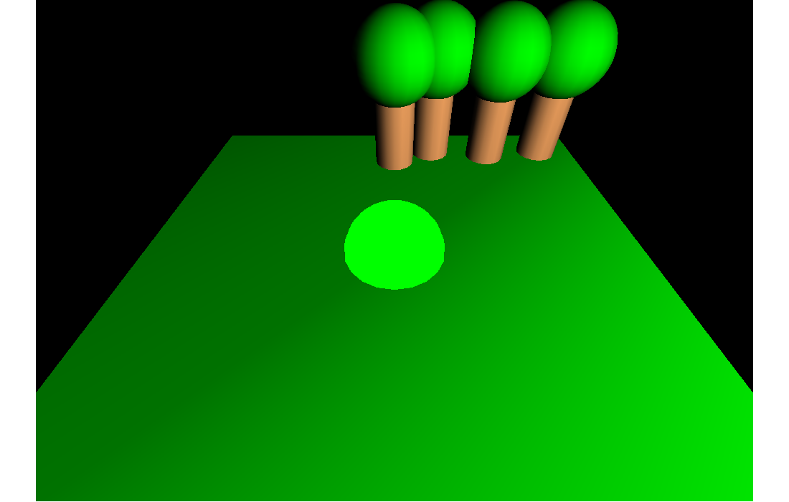
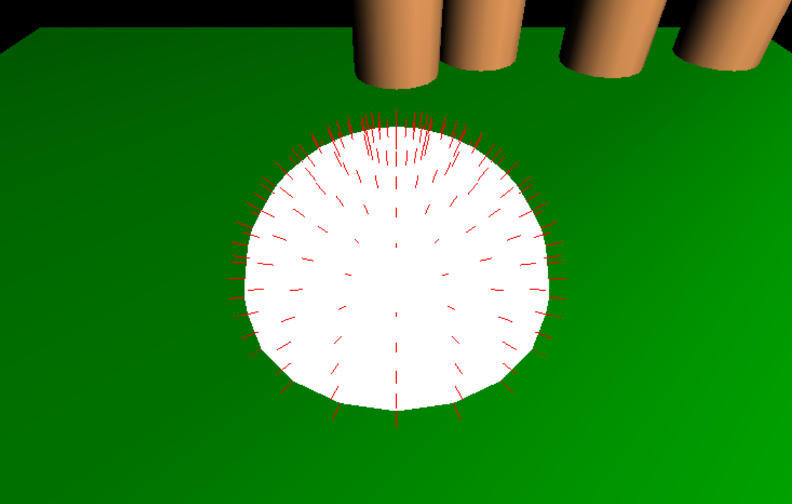
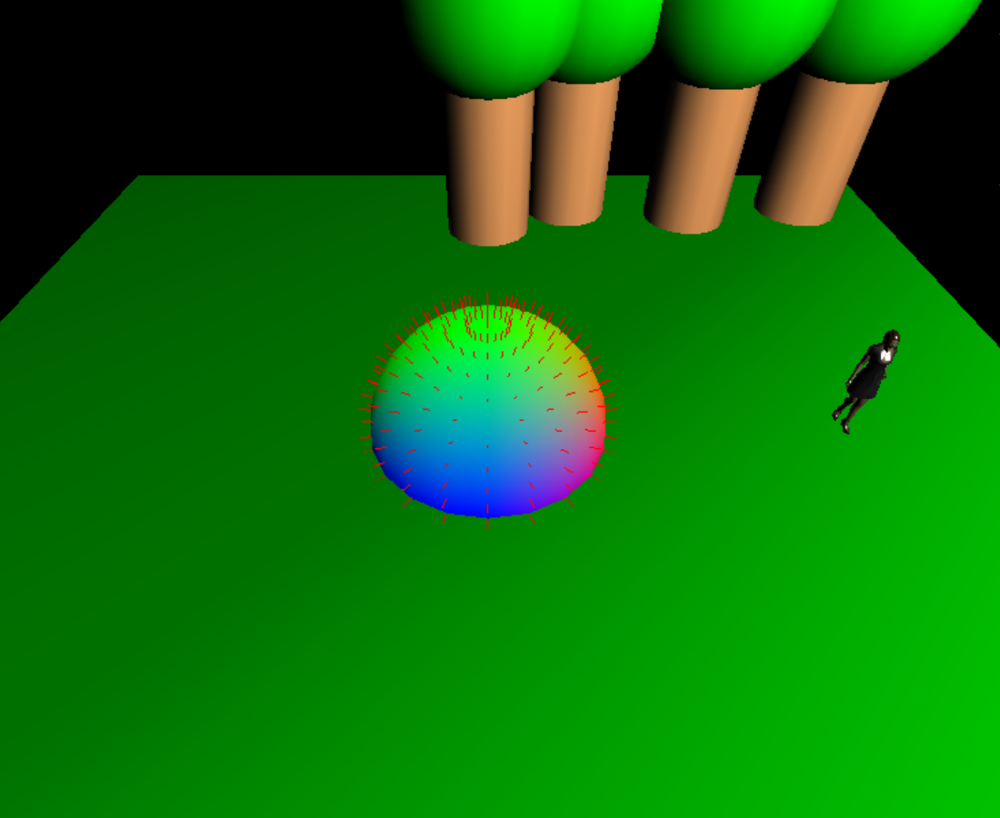
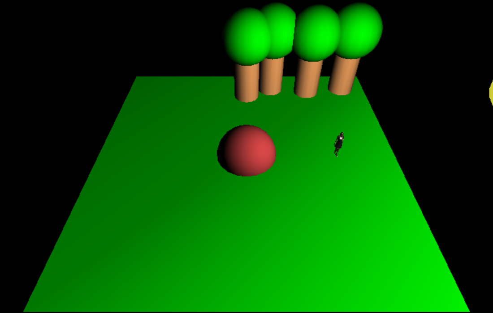
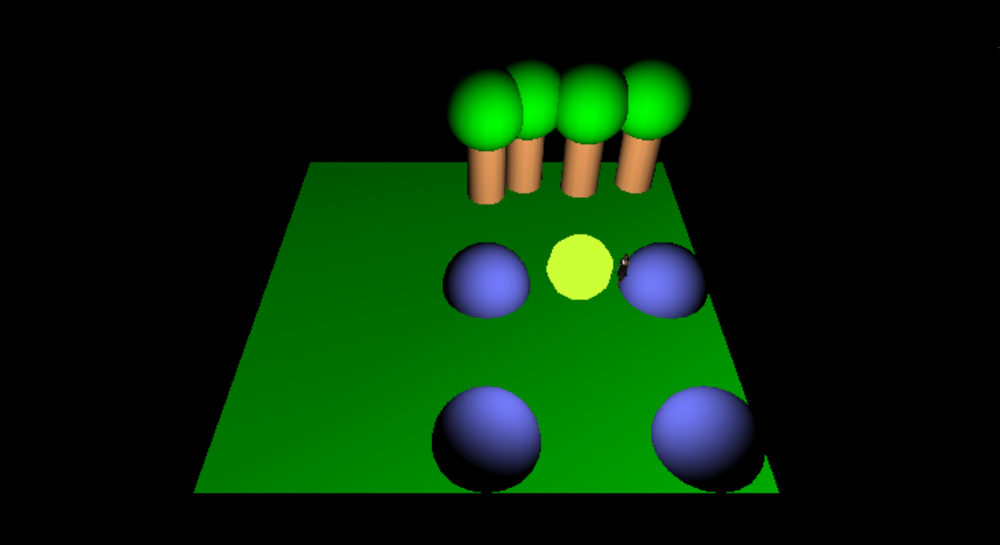
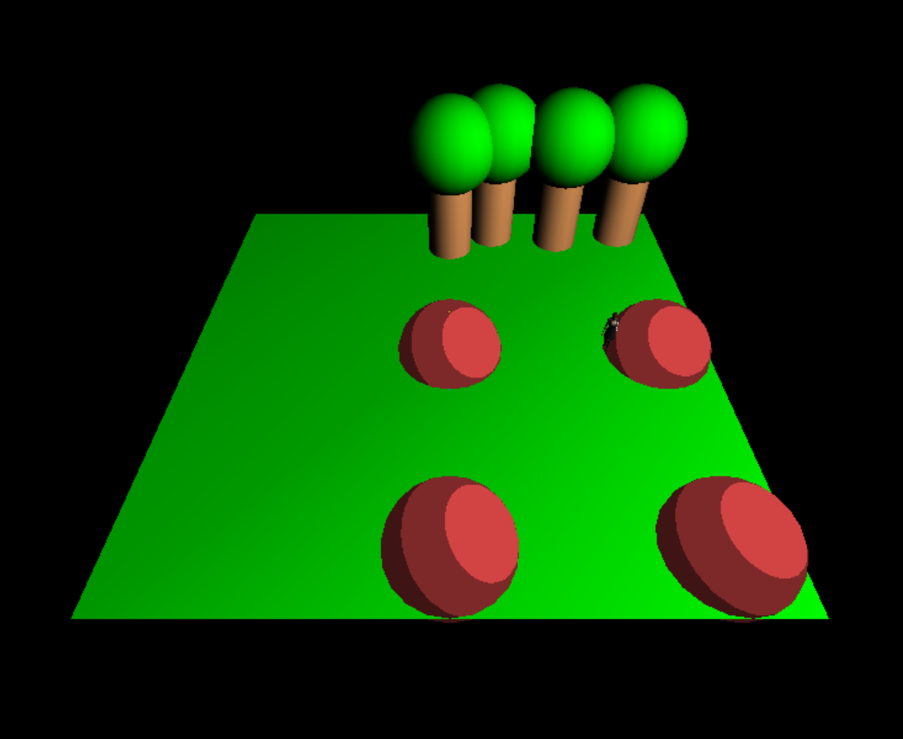
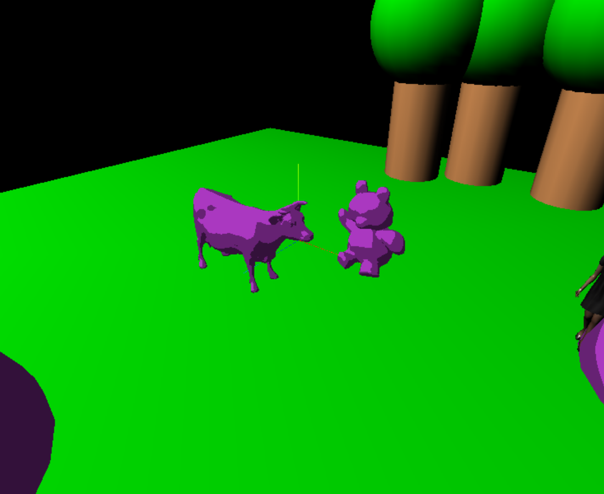

# Shaders

Voir Annexe 1 pour les notions d'éclairage.

## Intégration d'une instance MeshShaderMaterial

Travail demandé :
- Reprendre votre code issu du TP2, avec votre décor personnalisé.
- Ajouter un objet simple, de préférence ayant des surfaces arrondies (sphère, tore, donut, etc), à la manière du TP1. Cet objet servira de support de travail pour la suite.
- Changer le matériau de l'objet pour la classe ShaderMaterial. Un matériau utilisant des shaders nécessite de fournir le code pour le vertex shader et le pixel shader.
  - L'exemple basicshader.html est un bon point de départ. Lire la documentation et étudier les exemples fournis. 
  - Commencer par intégrer des shaders n'utilisant ni d'uniform, ni de varying.
- Vérifier que le programme utilise bien les shaders fournis par exemple en modifiant le code du pixel shader en changeant la couleur codée en dur.

## Programmation de shaders

### Remarque importante sur le développement de shaders
    
Malheureusement pour nous, les outils pour débugger les shaders sont peu accessibles. 
La méthode la plus accessible pour l'instant et par essai/erreur avec 
- Les retours d'erreurs de compilation de shader que l'on peut voir dans la console Javascript du navigateur 
- L'équivalent du printf dans les shaders, qui consiste à afficher sous forme de rendu (pixels colorés) les informations que l'on veut visualiser.

Il est donc important à ce niveau du développement de bien archiver des états **fonctionnels** des shaders pour pouvoir y revenir facilement.
En effet il est courant de se perdre et ne plus arriver à retomber sur ses pieds si l'on a fait trop de modifications. 
Les micro-commits sont le meilleur moyen pour ces sauvegardes, pensez-y !

### Travail demandé :
#### Usage des uniforms :
- Modifier le pixel shader pour passer une couleur en tant qu'uniform pour modifier à la volée la couleur de l'objet (voir l'exemple uniform.html)
- Connecter la valeur de cette couleur sur une interface dat-gui. Observez les changements de couleurs en fonction de vos changements dans l'interface.

#### Observation des normales des objets, usage des varyings :
- Utiliser la classe [VertexNormalsHelper](https://threejs.org/docs/#examples/en/helpers/VertexNormalsHelper) pour visualiser les normales de votre objet. 

- Vérifier que l'objet dispose de normales valides et qu'elles sont bien orientées, cela est crucial pour la suite des questions.
- Transmettre les normales du mesh depuis le vertex shader au pixel shader. Vous devrez utiliser la fonctionnalité **varying** de GLSL. 

Indications :
- Les valeurs des normales sont accessibles en tant qu'attribut de vertex sous le mot clé **normal** dans le vertex shader grâce aux [extensions prédéfinies des shaders dans Three.js](https://threejs.org/docs/#api/en/renderers/webgl/WebGLProgram)
- Le meilleur moyen de savoir si vous avez réussi l'étape précédente est de débugger avec le *printf* dans le shader : affichez sous forme de couleur RGB les valeurs des coordonnées XYZ des normales.

#### Implémentation d'un modèle d'éclairage
Vous savez maintenant transmettre une valeur (une couleur dans notre cas) en tant qu'uniform de shader. Vous avez également à disposition la normale à la surface de votre objet en chaque pixel à l'écran.
Nous allons pouvoir faire des effets avancés sur ces surfaces. Pour cela, nous allons implémenter un éclairage de shader type lambert, comme vu en TD.
Nous avons donc besoin de la normale, de la couleur, mais aussi de la direction de la lumière vu depuis la surface de l'objet. Etant donné que la lumière est ponctuelle, la direction de la lumière
vue depuis l'objet est différente en chaque point de l'objet, il faudra donc la calculer pour chaque pixel. Rappel : une direction entre 2 points est donnée par le vecteur normalisé entre ces 2 points.

Pour simplifier le problème, nous allons faire tous nos calculs dans le repère de la scène, c'est-à-dire les coordonnées que vous utilisez pour placer vos objets dans le Javascript.
Pour obtenir la position d'une objet dans le repère de la scène il vous faut multiplier les positions des objets dans leur repère local par la [modelMatrix](https://threejs.org/docs/#api/en/renderers/webgl/WebGLProgram).
Notons qu'il faut normalement faire de même pour les normales avec la matrice pour que ce soit juste (et pour être précis, il faudrait en fait multiplier par la transposée de la matrice inverse).
- Passer la position **dans le repère de la scène** de la surface de l'objet du vertex shader au pixel shader. Faire attention aux repères utilisés.
- Passer en tant qu'uniform la position **dans le repère de la scène** de la lumière ajoutée lors TP1.
- Avec la couleur, la normale, la position de la surface et la position de lumière, il y a maintenant tout ce qu'il faut pour calculer un éclairage de Lambert.

- Varier la position de votre lumière et observez les changements.
- Ajouter un jeu de test fiable prouvant que le calcul d'éclairage est juste.

Notes : 
- On peut éventuellement prendre en compte aussi la couleur de la lumière en multipliant le résultat du calcul d'éclairage par cette couleur.

#### Extension non réaliste (NPR) à partir d'un modèle d'éclairage
Vous disposez d'un rendu type lambert fonctionnel. A partir de cela on peut par exemple implémenter des rendus non réalistes comme le [toon shading](https://threejs.org/docs/#api/en/materials/MeshToonMaterial).
- Utiliser les valeurs calculées de l'éclairage de Lambert comme critère de seuillage pour obtenir des aplats de couleurs grâce au pixel shader

## Aller plus loin

Les sujets abordés ici sont avancés. Faites du mieux que vous pouvez et dans l'ordre de votre choix pour attaquer ces questions.

### Implémentation d'un modèle d'éclairage de Phong

A l'aide de l'annexe 1, essayez d'implémenter l'algorithme d'éclairage de Phong avec les shaders

### Utilisation des shaders sur les meshs OBJ

### Utilisation des textures dans les shaders

2 problèmes ici. Comme vu en TD2, il vous faut d'une part, un repère UV pour correctement plaquer une texture sur un objet 3D, d'autre part savoir accéder aux textures depuis un shader.
- S'inspirer de l'exemple fourni avec lenna pour comprendre comment accéder à une texture depuis un shader
- De la même manière que pour les normales, les meshs disposent potentiellement d'un attribut d'UV.
  - Vérifier que votre mesh dispose d'UV (attributes, varying, passage au pixel shader). S'inspirer des questions sur les normales
  - Utiliser les UVs pour échantillonner une texture

### Utilisation d'une lumière directionnelle

Souvent, dans les jeux vidéos, pour les scènes d'extérieur, l'éclairage venant du soleil est simulé par une source de lumière directionnelle. 
Une source de lumière directionnelle est définie par sa direction, identique en tout point de l'espace. Le soleil étant très éloigné, ses rayons arrivant à la surface de la Terre peuvent être considérés comme parallèles.

- Essayer de remplacer la source de lumière ponctuelle par une [source directionnelle](https://threejs.org/docs/#api/en/lights/DirectionalLight). Qu'est-ce que cela change dans vos calculs d'éclairage ?
- Essayer de gérer une lumière directionnelle et une seconde lumière ponctuelle. Note : la contribution d'une lumière à l'éclairage d'un objet s'ajoute aux contributions des autres lumières.

### Organisation des sources de shaders

Pour l'instant, les sources des programmes GLSL ont été fournies à Three.js via des strings Javascript. Ce n'est pas le plus agréable, et d'ailleurs, on stocke habituellement chaque shader dans un fichier séparé.

- Trouver un moyen d'organiser le code GLSL dans des fichiers séparés, avec dans l'idéal, un fichier par programme GLSL.

## Annexe 1

Il faut bien distinguer le modèle d'ombrage (shading) du modèle d'éclairage (lighting, ou réflexion). Phong a développé les 2 principes d'où le fait qu'un modèle d'éclairage et un modèle d'ombrage porte son nom.

Pour les modèles d'éclairage, des pointeurs pour démarrer :
- [Blinn-Phong](https://en.wikipedia.org/wiki/Blinn%E2%80%93Phong_shading_model)
- [Phong](https://en.wikipedia.org/wiki/Phong_reflection_model)

Pour faire le distinguo avec le modèle d'ombrage : 
- [Phong](https://en.wikipedia.org/wiki/Phong_shading)
